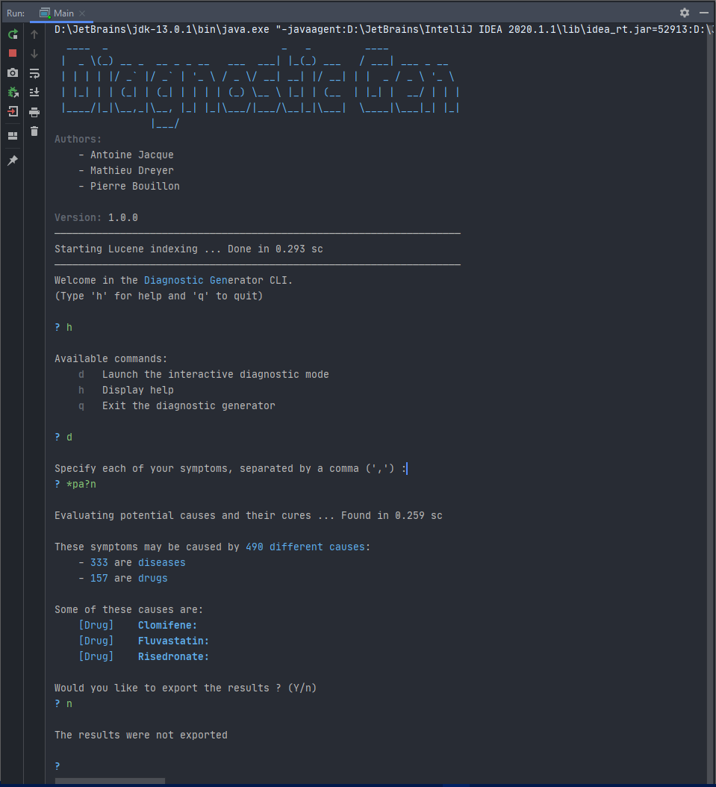

# GMD

GMD 2A App project

## Concept

Given some symptoms or effect that the user is experiencing and that he provides to the app, our solution will
find the potential causes of the trouble he is experiencing.

These causes may be drugs or diseases.

> This fork was made before the final version of the project (complete CLI and cure for each cause diagnosed)

## Goals

- Cross several data sources to retrieve valuable information
- Index and search a large amount of data using [Lucene](https://lucene.apache.org/)

### CLI Preview

